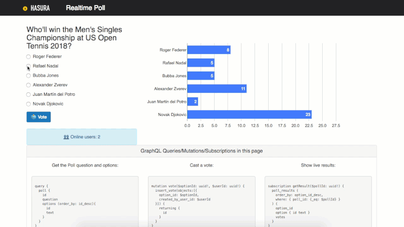

[][1]

Sandip Devarkonda is a product manager, helping build cutting edge developer tools at Hasura. He dabbles in technology forecasts and predicts that GraphQL will … [More about Sandip][2]

*   December 10, 2018
*   [Leave a comment][3]

Building real-time applications is hard. However, GraphQL is rapidly upending this status-quo. Let’s explore what GraphQL is, and then take it for a spin by building a poll app in which users can vote and on-screen aggregated results are updated in real time.

<picture>
  <source
    type="image/webp"
    srcset="images/cda0fa6801401cbf15fe6d6b1c756356d1618427f2152671d13319aa69643a13_i.webp" />

  
</picture>
 
<picture>
  <source
    type="image/webp"
    srcset="images/265b968612d8602e485d8f4519d21fddc3b2aecf4fdc39f2268d1ca276e2a825_character-13.webp" />

  
</picture>

In this article, we’ll take a look at the challenges involved in building real-time applications and how emerging tooling is addressing them with elegant solutions that are easy to reason about. To do this, we’ll build a real-time polling app (like a Twitter poll with real-time overall stats) just by using Postgres, GraphQL, React and no backend code!

The primary focus will be on setting up the backend (deploying the ready-to-use tools, schema modeling), and aspects of frontend integration with GraphQL and less on UI/UX of the frontend (some knowledge of ReactJS will help). The tutorial section will take a paint-by-numbers approach, so we’ll just clone a GitHub repo for the schema modeling, and the UI and tweak it, instead of building the entire app from scratch.

Do you know everything you need to know about GraphQL? If you have your doubts, Eric Baer has you covered with a detailed guide on its origins, its drawbacks and the basics of how to work with it. [Read article →][4]

Before you continue reading this article, I’d like to mention that a working knowledge of the following technologies (or substitutes) are beneficial:

*   **ReactJS**  
    This can be replaced with any frontend framework, Android or IOS by following the client library documentation.
*   **Postgres**  
    You can work with other databases but with different tools, the principles outlined in this post will still apply.

You can also adapt this tutorial context for other real-time apps very easily.

<picture>
  <source
    type="image/webp"
    srcset="images/c29a7f038f6786aec8e3a54e989a426328662621cb4ca810c5c2047f98e0b2b9_real-time-poll-app-800w.webp" />

  
</picture>

A demonstration of the features in the polling app that we’ll be building. ([Large preview][5])

As illustrated by the accompanying GraphQL payload at the bottom, there are three major features that we need to implement:

1.  Fetch the poll question and a list of options (top left).
2.  Allow a user to vote for a given poll question (the “Vote” button).
3.  Fetch results of the poll in real-time and display them in a bar graph (top right; we can gloss over the feature to fetch a list of currently online users as it’s an exact replica of this use case).

### Challenges With Building Real-Time Apps

Building real-time apps (especially as a frontend developer or someone who’s recently made a transition to becoming a fullstack developer), is a hard engineering problem to solve. This is generally how contemporary real-time apps work (in the context of our example app):

1.  The frontend updates a database with some information; A user’s vote is sent to the backend, i.e. poll/option and user information (`user_id`, `option_id`).
2.  The first update triggers another service that aggregates the poll data to render an output that is relayed back to the app in real-time (every time a new vote is cast by anyone; if this done efficiently, only the updated poll’s data is processed and only those clients that have subscribed to this poll are updated):
    *   Vote data is first processed by an `register_vote` service (assume that some validation happens here) that triggers a `poll_results` service.
    *   Real-time aggregated poll data is relayed by the `poll_results` service to the frontend for displaying overall statistics.

<picture>
  <source
    type="image/webp"
    srcset="images/b01a717c1b8373591726d9d1c1ab23804d63fc76e5e542d9b95a8705a44c2ae9_poll-app-traditional-design.png 400w, images/fe58cc815a61d927bd0dfbab546d6de186b43489f4b2727f846f23f81052c6f1_poll-app-traditional-design.png 800w, images/88457b124b3cb152d97151f6fc2700a5db5a266dec71bb9c4914aa9f261be56b_poll-app-traditional-design.jpeg 1200w, images/0cbe99174e945ffeb412ee00cbf81f3ea3d8ca847ca1f865b6564cc4992b69cb_poll-app-traditional-design.jpeg 1600w, images/9355976dd1c15b5cbd85a8e007fca2e001db7a95de317fd0ba8ac61779af869c_poll-app-traditional-design.jpeg 2000w" />

  <source
    type="image/webp"
    srcset="images/b01a717c1b8373591726d9d1c1ab23804d63fc76e5e542d9b95a8705a44c2ae9_poll-app-traditional-design.png 400w,
			        images/fe58cc815a61d927bd0dfbab546d6de186b43489f4b2727f846f23f81052c6f1_poll-app-traditional-design.png 800w,
			        images/88457b124b3cb152d97151f6fc2700a5db5a266dec71bb9c4914aa9f261be56b_poll-app-traditional-design.jpeg 1200w,
			        images/0cbe99174e945ffeb412ee00cbf81f3ea3d8ca847ca1f865b6564cc4992b69cb_poll-app-traditional-design.jpeg 1600w,
			        images/9355976dd1c15b5cbd85a8e007fca2e001db7a95de317fd0ba8ac61779af869c_poll-app-traditional-design.webp" />

  
</picture>

A poll app designed traditionally

This model is derived from a traditional API-building approach, and consequently has similar problems:

1.  Any of the sequential steps could go wrong, leaving the UX hanging and affecting other independent operations.
2.  Requires a lot of effort on the API layer as it’s a single point of contact for the frontend app, that interacts with multiple services. It also needs to implement a websockets-based real-time API — there is no universal standard for this and therefore sees limited support for automation in tools.
3.  The frontend app is required to add the necessary plumbing to consume the real-time API and may also have to solve the data consistency problem typically seen in real-time apps (less important in our chosen example, but critical in ordering messages in a real-time chat app).
4.  Many implementations resort to using additional non-relational databases on the server-side (Firebase, etc.) for easy real-time API support.

Let’s take a look at how GraphQL and associated tooling address these challenges.

### What Is GraphQL?

GraphQL is a specification for a query language for APIs, and a server-side runtime for executing queries. This specification was developed by Facebook to accelerate app development and provide a standardized, database-agnostic data access format. Any specification-compliant GraphQL server must support the following:

1.  **Queries for reads**  
    A request type for requesting nested data from a data source (which can be either one or a combination of a database, a REST API or another GraphQL schema/server).
2.  **Mutations for writes**  
    A request type for writing/relaying data into the aforementioned data sources.
3.  **Subscriptions for live-queries**  
    A request type for clients to subscribe to real-time updates.

GraphQL also uses a typed schema. The ecosystem has plenty of tools that help you identify errors at dev/compile time which results in fewer runtime bugs.

Here’s why GraphQL is great for real-time apps:

*   Live-queries (subscriptions) are an implicit part of the GraphQL specification. Any GraphQL system has to have native real-time API capabilities.
*   A standard spec for real-time queries has consolidated community efforts around client-side tooling, resulting in a very intuitive way of integrating with GraphQL APIs.

GraphQL and a combination of open-source tooling for database events and serverless/cloud functions offer a great substrate for building cloud-native applications with asynchronous business logic and real-time features that are easy to build and manage. This new paradigm also results in great user and developer experience.

In the rest of this article, I will use open-source tools to build an app based on this architecture diagram:

<picture>
  <source
    type="image/webp"
    srcset="images/10667c660265390d76b7d7a554ec44a6da4e5f39d5484ab4a07ea418c070e5e7_poll-app-graphql-design.png 400w, images/115ac0e3862ee1e28104f172a04078ad56f6183597bacc042dd555e5c2aac7da_poll-app-graphql-design.png 800w, images/fc122ad533f26103e4faf4805dfcac62268c2196d0c1fdd457ae314b9feb02fa_poll-app-graphql-design.png 1200w, images/8a77c64cbb69ed5adf41fb5228eae66e074d6e03617dfd7c4ab75fc28d6ee70a_poll-app-graphql-design.png 1600w, images/6b81f739eedd728245d1d6baeb198064222486631817de537a1fa06c353542ca_poll-app-graphql-design.jpeg 2000w" />

  <source
    type="image/webp"
    srcset="images/10667c660265390d76b7d7a554ec44a6da4e5f39d5484ab4a07ea418c070e5e7_poll-app-graphql-design.png 400w,
			        images/115ac0e3862ee1e28104f172a04078ad56f6183597bacc042dd555e5c2aac7da_poll-app-graphql-design.png 800w,
			        images/fc122ad533f26103e4faf4805dfcac62268c2196d0c1fdd457ae314b9feb02fa_poll-app-graphql-design.png 1200w,
			        images/8a77c64cbb69ed5adf41fb5228eae66e074d6e03617dfd7c4ab75fc28d6ee70a_poll-app-graphql-design.png 1600w,
			        images/6b81f739eedd728245d1d6baeb198064222486631817de537a1fa06c353542ca_poll-app-graphql-design.webp" />

  
</picture>

A poll app designed with GraphQL

### Building A Real-Time Poll/Voting App

With that introduction to GraphQL, let’s get back to building the polling app as described in the first section.

The three features (or stories highlighted) have been chosen to demonstrate the different GraphQL requests types that our app will make:

1.  **Query**  
    Fetch the poll question and its options.
2.  **Mutation**  
    Let a user cast a vote.
3.  **Subscription**  
    Display a real-time dashboard for poll results.

<picture>
  <source
    type="image/webp"
    srcset="images/09dda790fc93bffb47778dc161807a8278f9db06cf102520def2711e8b74b9d7_poll-app-graphql-elements.png 400w, images/0d554f11ec444d97f6ac6c27bd507b522c6dbf0de24696e279f6c0ca5a62cc3f_poll-app-graphql-elements.png 800w, images/55aa051686a67497cd5de10b80527ed499cf32f415894d4ce4305987c02fc938_poll-app-graphql-elements.png 1200w, images/3141ce1c5ea9ef56dc8d23df2cb9ec6290d39106a0e1df9ef744d9d3db383960_poll-app-graphql-elements.png 1600w, images/a48ca80d5b2b6faa1c6415ed1851bc71a753fc9e04b2d0090f8bea3c44b1e64f_poll-app-graphql-elements.jpeg 2000w" />

  <source
    type="image/webp"
    srcset="images/09dda790fc93bffb47778dc161807a8278f9db06cf102520def2711e8b74b9d7_poll-app-graphql-elements.png 400w,
			        images/0d554f11ec444d97f6ac6c27bd507b522c6dbf0de24696e279f6c0ca5a62cc3f_poll-app-graphql-elements.png 800w,
			        images/55aa051686a67497cd5de10b80527ed499cf32f415894d4ce4305987c02fc938_poll-app-graphql-elements.png 1200w,
			        images/3141ce1c5ea9ef56dc8d23df2cb9ec6290d39106a0e1df9ef744d9d3db383960_poll-app-graphql-elements.png 1600w,
			        images/a48ca80d5b2b6faa1c6415ed1851bc71a753fc9e04b2d0090f8bea3c44b1e64f_poll-app-graphql-elements.webp" />

  
</picture>

GraphQL request types in the poll app ([Large preview][6])

#### Prerequisites

*   **A Heroku account** (use the free tier, no credit card required)  
    To deploy a GraphQL backend (see next point below) and a Postgres instance.
*   **Hasura GraphQL Engine** (free, open-source)  
    A ready-to-use GraphQL server on Postgres.
*   **Apollo Client** (free, open-source SDK)  
    For easily integrating clients apps with a GraphQL server.
*   **npm** (free, open-source package manager)  
    To run our React app.

#### Deploying The Database And A GraphQL Backend

We will deploy an instance each of Postgres and GraphQL Engine on Heroku’s free tier. We can use a nifty Heroku button to do this with a single click.

<picture>
  <source
    type="image/webp"
    srcset="images/9b18f689fe7657c3165f5c0d37b692f48c76897cacf79901ed28af367693db9f_how-to-build-a-real-time-app.webp" />

  
</picture>

Heroku button

**Note:** _You can also follow this [link][7] or search for documentation Hasura GraphQL deployment for Heroku (or other platforms)._

<picture>
  <source
    type="image/webp"
    srcset="images/f2533a0b401e1acdb39e42d73674c5dc8c1f3f29da6bf859450b1e6f6ef2f466_deploy-hge-realtime-app.png 400w, images/f462c603a2f18d15fd495f3663e2621c9bc082e6e9195c5312974f23db5a7213_deploy-hge-realtime-app.png 800w, images/3fcdac4db2103eecde61215aedc5d4b4eeed7a19aedd8ea225c2f54a8540ea42_deploy-hge-realtime-app.png 1200w, images/a6df1851f44e1c43698c99e049ac30586c958092dac9907133444bbb4461f765_deploy-hge-realtime-app.png 1600w, images/933b2fa8dd48806cf0f2a8768857dd8b4e912701274f39fce2a2c5b695848211_deploy-hge-realtime-app.png 2000w" />

  <source
    type="image/webp"
    srcset="images/f2533a0b401e1acdb39e42d73674c5dc8c1f3f29da6bf859450b1e6f6ef2f466_deploy-hge-realtime-app.png 400w,
			        images/f462c603a2f18d15fd495f3663e2621c9bc082e6e9195c5312974f23db5a7213_deploy-hge-realtime-app.png 800w,
			        images/3fcdac4db2103eecde61215aedc5d4b4eeed7a19aedd8ea225c2f54a8540ea42_deploy-hge-realtime-app.png 1200w,
			        images/a6df1851f44e1c43698c99e049ac30586c958092dac9907133444bbb4461f765_deploy-hge-realtime-app.png 1600w,
			        images/933b2fa8dd48806cf0f2a8768857dd8b4e912701274f39fce2a2c5b695848211_deploy-hge-realtime-app.webp" />

  
</picture>

Deploying Postgres and GraphQL Engine to Heroku’s free tier ([Large preview][8])

You will not need any additional configuration, and you can just click on the “Deploy app” button. Once the deployment is complete, make a note of the app URL:

~~~bash
<app-name>.herokuapp.com

~~~

For example, in the screenshot above, it would be:

~~~bash
hge-realtime-app-tutorial.herokuapp.com

~~~

What we’ve done so far is deploy an instance of Postgres (as an add-on in Heroku parlance) and an instance of GraphQL Engine that is configured to use this Postgres instance. As a result of doing so, we now have a ready-to-use GraphQL API but, since we don’t have any tables or data in our database, this is not useful yet. So, let’s address this immediately.

#### Modeling the database schema

The following schema diagram captures a simple relational database schema for our poll app:

<picture>
  <source
    type="image/webp"
    srcset="images/096cf1e4115f4984f42f99e4c7ea1c3cc2f3a048cca3a26a1b42bfbe748f5e3c_schema-design-realtime-app.png 400w, images/24a5f8a7b63a68f76f7a441eeb56841ba5f4a36975ac2888d5dbcd782180bc94_schema-design-realtime-app.png 800w, images/284716031a1f5cf7baa1eb01ee2124654b6fcf9eb6fcb718b94d17b88f243aca_schema-design-realtime-app.png 1200w, images/0472c64debfa6a13b65dc1103c0b6dd988fe674db49e7ec8d61045ba550ac68a_schema-design-realtime-app.png 1600w, images/8b4982ab82e9d52dc6141dba8c04466a4a6e21c0522b85c6c76bdfd6cf8e313f_schema-design-realtime-app.png 2000w" />

  <source
    type="image/webp"
    srcset="images/096cf1e4115f4984f42f99e4c7ea1c3cc2f3a048cca3a26a1b42bfbe748f5e3c_schema-design-realtime-app.png 400w,
			        images/24a5f8a7b63a68f76f7a441eeb56841ba5f4a36975ac2888d5dbcd782180bc94_schema-design-realtime-app.png 800w,
			        images/284716031a1f5cf7baa1eb01ee2124654b6fcf9eb6fcb718b94d17b88f243aca_schema-design-realtime-app.png 1200w,
			        images/0472c64debfa6a13b65dc1103c0b6dd988fe674db49e7ec8d61045ba550ac68a_schema-design-realtime-app.png 1600w,
			        images/8b4982ab82e9d52dc6141dba8c04466a4a6e21c0522b85c6c76bdfd6cf8e313f_schema-design-realtime-app.webp" />

  
</picture>

Schema design for the poll app. ([Large preview][9])

As you can see, the schema is a simple, normalized one that leverages foreign-key constraints. It is these constraints that are interpreted by the GraphQL Engine as 1:1 or 1:many relationships (e.g. `poll:options` is a 1: many relationship since each poll will have more than 1 option that are linked by the foreign key constraint between the `id` column of the `poll` table and the `poll_id` column in the `option` table). Related data can be modelled as a graph and can thus power a GraphQL API. This is precisely what the GraphQL Engine does.

Based on the above, we’ll have to create the following tables and constraints to model our schema:

1.  `Poll`  
    A table to capture the poll question.
2.  `Option`  
    Options for each poll.
3.  `Vote`  
    To record a user’s vote.
4.  Foreign-key constraint between the following fields (`table : column`):
    *   `option : poll_id → poll : id`
    *   `vote : poll_id → poll : id`
    *   `vote : created_by_user_id → user : id`

Now that we have our schema design, let’s implement it in our Postgres database. To instantly bring this schema up, here’s what we’ll do:

1.  [Download][10] the GraphQL Engine CLI.
2.  Clone this repo:  
    
    ~~~bash
    $ git clone clone https://github.com/hasura/graphql-engine
    
    $ cd graphql-engine/community/examples/realtime-poll
    ~~~
    
3.  Go to `hasura/` and edit `config.yaml`:  
    
    ~~~bash
    endpoint: https://<app-name>.herokuapp.com
    ~~~
    
4.  Apply the migrations using the CLI, from inside the project directory (that you just downloaded by cloning):  
    
    ~~~bash
    $ hasura migrate apply
    ~~~
    

That’s it for the backend. You can now open the GraphQL Engine console and check that all the tables are present (the console is available at `https://<app-name>.herokuapp.com/console`).

**Note:** _You could also have used the console to implement the schema by creating individual tables and then adding constraints using a UI. Using the built-in support for migrations in GraphQL Engine is just a convenient option that was available because our sample repo has migrations for bringing up the required tables and configuring relationships/constraints (this is also highly recommended regardless of whether you are building a hobby project or a production-ready app)._

#### Integrating The Frontend React App With The GraphQL Backend

The frontend in this tutorial is a simple app that shows poll question, the option to vote and the aggregated poll results in one place. As I mentioned earlier, we’ll first focus on running this app so you get the instant gratification of using our recently deployed GraphQL API , see how the GraphQL concepts we looked at earlier in this article power the different use-cases of such an app, and then explore how the GraphQL integration works under the hood.

**NOTE:** _If you are new to ReactJS, you may want to check out some of [these articles][11]. We won’t be getting into the details of the React part of the app, and instead, will focus more on the GraphQL aspects of the app. You can refer to the source code in the repo for any details of how the React app has been built_.

##### Configuring The Frontend App

1.  In the repo cloned in the previous section, edit `HASURA_GRAPHQL_ENGINE_HOSTNAME` in the _src/apollo.js_ file (inside the `/community/examples/realtime-poll` folder) and set it to the Heroku app URL from above:  
    
    ~~~javascript
    export const HASURA_GRAPHQL_ENGINE_HOSTNAME = 'random-string-123.herokuapp.com';
    ~~~
    
2.  Go to the root of the repository/app-folder (`/realtime-poll/`) and use npm to install the prequisite modules and then run the app:  
    
    ~~~bash
    $ npm install
    
    $ npm start
    
    ~~~
    

<picture>
  <source
    type="image/webp"
    srcset="images/33f2776f35f479bf9730b4e103dd5c44cde759763a05b9aaa3324716f13d53bc_screenshot-realtime-app.png 400w, images/c96d3c1c70eba58bb669047a6ad400155ae59e80f04041e0ca9131e966c4f8c5_screenshot-realtime-app.png 800w, images/5c9c3c2c3678d9a97c7789591bdaa271e01df1b253c4eac06043b53abe2caaa2_screenshot-realtime-app.png 1200w, images/0a89cf53fdd694b96d8d8dccc8f56cfc339d0319f606ac5623b1a170c568565b_screenshot-realtime-app.png 1600w, images/879bd7d12fabda949e57a990be5433a63df16d082e70f648684d203e87080b83_screenshot-realtime-app.jpeg 2000w" />

  <source
    type="image/webp"
    srcset="images/33f2776f35f479bf9730b4e103dd5c44cde759763a05b9aaa3324716f13d53bc_screenshot-realtime-app.png 400w,
			        images/c96d3c1c70eba58bb669047a6ad400155ae59e80f04041e0ca9131e966c4f8c5_screenshot-realtime-app.png 800w,
			        images/5c9c3c2c3678d9a97c7789591bdaa271e01df1b253c4eac06043b53abe2caaa2_screenshot-realtime-app.png 1200w,
			        images/0a89cf53fdd694b96d8d8dccc8f56cfc339d0319f606ac5623b1a170c568565b_screenshot-realtime-app.png 1600w,
			        images/879bd7d12fabda949e57a990be5433a63df16d082e70f648684d203e87080b83_screenshot-realtime-app.webp" />

  
</picture>

Screenshot of the live poll app ([Large preview][12])

You should be able to play around with the app now. Go ahead and vote as many times as you want, you’ll notice the results changing in real time. In fact, if you set up another instance of this UI and point it to the same backend, you’ll be able to see results aggregated across all the instances.

So, how does this app use GraphQL? Read on.

### Behind The Scenes: GraphQL

In this section, we’ll explore the GraphQL features powering the app, followed by a demonstration of the ease of integration in the next one.

#### The Poll Component And The Aggregated Results Graph

The poll component on the top left that fetches a poll with all of its options and captures a user’s vote in the database. Both of these operations are done using the GraphQL API. For fetching a poll’s details, we make a query (remember this from the GraphQL introduction?):

~~~bash
query {
  poll {
    id
    question
    options {
      id
      text
    }
  }
}

~~~

Using the Mutation component from `react-apollo`, we can wire up the mutation to a HTML form such that the mutation is executed using variables `optionId` and `userId` when the form is submitted:

~~~javascript
mutation vote($optionId: uuid!, $userId: uuid!) {
  insert_vote(objects: [{option_id: $optionId, created_by_user_id: $userId}]) {
    returning {
      id
    }
  }
}

~~~

To show the poll results, we need to derive the count of votes per option from the data in vote table. We can create a Postgres View and track it using GraphQL Engine to make this derived data available over GraphQL.

~~~javascript
CREATE VIEW poll_results AS
 SELECT poll.id AS poll_id, o.option_id, count(*) AS votes
 FROM (( SELECT vote.option_id, option.poll_id, option.text
   FROM ( vote
          LEFT JOIN 
      public.option ON ((option.id = vote.option_id)))) o
 
           LEFT JOIN poll ON ((poll.id = o.poll_id)))
 GROUP BY poll.question, o.option_id, poll.id;

~~~

The `poll_results` view joins data from `vote` and `poll` tables to provide an aggregate count of number of votes per each option.

Using GraphQL Subscriptions over this view, [react-google-charts][13] and the subscription component from `react-apollo`, we can wire up a reactive chart which updates in realtime when a new vote happens from any client.

~~~javascript
subscription getResult($pollId: uuid!) {
  poll_results(where: {poll_id: {_eq: $pollId}}) {
    option {
      id
      text
    }
    votes
  }
}

~~~

#### GraphQL API Integration

As I mentioned earlier, I used Apollo Client, an open-source SDK to integrate a ReactJS app with the GraphQL backend. Apollo Client is analogous to any HTTP client library like [requests for python][14], the standard [http module for JavaScript][15], and so on. It encapsulates the details of making an HTTP request (in this case POST requests). It uses the configuration (specified in `src/apollo.js`) to make query/mutation/subscription requests (specified in _src/GraphQL.jsx_ with the option to use variables that can be dynamically substituted in the JavaScript code of your REACT app) to a GraphQL endpoint. It also leverages the typed schema behind the GraphQL endpoint to provide compile/dev time validation for the aforementioned requests. Let’s see just how easy it is for a client app to make a live-query (subscription) request to the GraphQL API.

##### Configuring The SDK

The Apollo Client SDK needs to be pointed at a GraphQL server, so it can automatically handle the boilerplate code typically needed for such an integration. So, this is exactly what we did when we modified _src/apollo.js_ when setting up the frontend app.

##### Making A GraphQL Subscription Request (Live-Query)

Define the subscription we looked at in the previous section in the _src/GraphQL.jsx_ file:

~~~javascript
const SUBSCRIPTION_RESULT = `
subscription getResult($pollId: uuid!) {
  poll_results (
    order_by: option_id_desc,
    where: { poll_id: {_eq: $pollId} }
  ) {
    option_id
    option { id text }
    votes
  }
}`;

~~~

We’ll use this definition to wire up our React component:

~~~javascript
export const Result = (pollId) => (
  <Subscription subscription={gql`${SUBSCRIPTION_RESULT}`} variables={pollId}>
    {({ loading, error, data }) => {
       if (loading) return Loading...
;
       if (error) return 
~~~

One thing to note here is that the above subscription could also have been a query. Merely replacing one keyword for another gives us a “live-query”, and that’s all it takes for the Apollo Client SDK to hook this real-time API with your app. Every time there’s a new dataset from our live-query, the SDK triggers a re-render of our chart with this updated data (using the `renderChart(data)` call). That’s it. It really is that simple!

### Final Thoughts

In three simple steps (creating a GraphQL backend, modeling the app schema, and integrating the frontend with the GraphQL API), you can quickly wire-up a fully-functional real-time app, without getting mired in unnecessary details such as setting up a websocket connection. That right there is the power of community tooling backing an abstraction like GraphQL.

If you’ve found this interesting and want to explore GraphQL further for your next side project or production app, here are some factors you may want to use for building your GraphQL toolchain:

*   **Performance & Scalability**  
    GraphQL is meant to be consumed directly by frontend apps (it’s no better than an ORM in the backend; real productivity benefits come from doing this). So your tooling needs to be smart about efficiently using database connections and should be able scale effortlessly.
*   **Security**  
    It follows from above that a mature role-based access-control system is needed to authorize access to data.
*   **Automation**  
    If you are new to the GraphQL ecosystem, handwriting a GraphQL schema and implementing a GraphQL server may seem like daunting tasks. Maximize the automation from your tooling so you can focus on the important stuff like building user-centric frontend features.
*   **Architecture**  
    As trivial as the above efforts seem like, a production-grade app’s backend architecture may involve advanced GraphQL concepts like schema-stitching, etc. Moreover, the ability to easily generate/consume real-time APIs opens up the possibility of building asynchronous, reactive apps that are resilient and inherently scalable. Therefore, it’s critical to evaluate how GraphQL tooling can streamline your architecture.

#### Related Resources

*   You can check out a live version of the app over [here][16].
*   The complete source code is available on [GitHub][17].
*   If you’d like to explore the database schema and run test GraphQL queries, you can do so over [here][18].

<picture>
  <source
    type="image/webp"
    srcset="images/09f6f6b2955c0a6b7df7aa87ffdbb3ef578df19b4f75bdaffdac3d0de4f98dc0_logo--red.webp" />

  
</picture>
 (rb, ra, yk, il)

[1]: https://www.smashingmagazine.com/author/sandip-devarkonda
[2]: https://www.smashingmagazine.com/author/sandip-devarkonda
[3]: https://www.smashingmagazine.com/2018/12/real-time-app-graphql-subscriptions-postgres/#comments-real-time-app-graphql-subscriptions-postgres
[4]: https://www.smashingmagazine.com/2018/01/graphql-primer-new-api-part-1/
[5]: images/c29a7f038f6786aec8e3a54e989a426328662621cb4ca810c5c2047f98e0b2b9_real-time-poll-app-800w.gif
[6]: https://cloud.netlifyusercontent.com/assets/344dbf88-fdf9-42bb-adb4-46f01eedd629/72306f74-09c6-4f52-bfd0-2c9fec9da118/poll-app-graphql-elements.png
[7]: https://heroku.com/deploy?template=https://github.com/hasura/graphql-engine-heroku
[8]: https://cloud.netlifyusercontent.com/assets/344dbf88-fdf9-42bb-adb4-46f01eedd629/226dddbc-ebfb-4ccf-84c3-fb3dc1e487db/deploy-hge-realtime-app.png
[9]: https://cloud.netlifyusercontent.com/assets/344dbf88-fdf9-42bb-adb4-46f01eedd629/6796af2f-9933-45bd-b91a-df57adf5b8a9/schema-design-realtime-app.png
[10]: https://docs.hasura.io/1.0/graphql/manual/hasura-cli/install-hasura-cli.html
[11]: https://www.smashingmagazine.com/category/react/
[12]: https://cloud.netlifyusercontent.com/assets/344dbf88-fdf9-42bb-adb4-46f01eedd629/399070ab-e84f-4854-9e99-bb108b7b9b03/screenshot-realtime-app.png
[13]: https://www.npmjs.com/package/react-google-charts
[14]: http://docs.python-requests.org/en/master/
[15]: https://nodejs.org/api/http.html
[16]: https://shahidh.in/hasura-realtime-poll/
[17]: https://github.com/hasura/graphql-engine/tree/master/community/examples/realtime-poll
[18]: https://hasura-realtime-dashboard.herokuapp.com/console/data/schema/public

